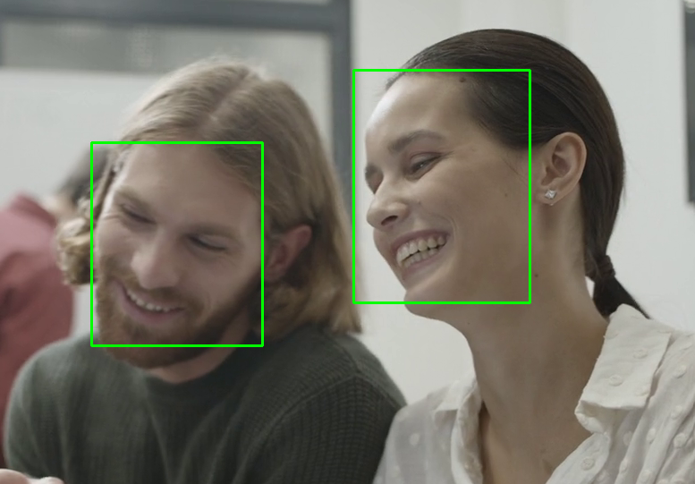

# Face Detection with OpenCV




This project detects faces from a webcam or video using OpenCV in C++. It supports two methods:

- **Haar Cascade** — fast, works for frontal faces.
- **DNN (Deep Neural Network)** — more accurate, detects side profiles and small faces.

You can choose which one to use when running the program.

---

## 🛠️ Features

- Detect faces from webcam or video file
- Switch between Haar and DNN face detectors
- Confidence filtering and temporal stability for reduced false positives
- Modular architecture with extendable interface (`FaceDetector`)

---

## 📦 Requirements

- OpenCV 4.x (with DNN module)
- CMake 3.10+
- C++ compiler (supporting C++17 or newer)

---

## 📁 Required Files

### 1. Haar Classifier

Place in: `classifiers/`

- [`haarcascade_frontalface_default.xml`](https://github.com/opencv/opencv/blob/master/data/haarcascades/haarcascade_frontalface_default.xml)

### 2. DNN Model

Place in: `models/`

- [`deploy.prototxt`](https://github.com/opencv/opencv/blob/master/samples/dnn/face_detector/deploy.prototxt)
- [`res10_300x300_ssd_iter_140000.caffemodel`](https://github.com/opencv/opencv_3rdparty/blob/dnn_samples_face_detector_20170830/res10_300x300_ssd_iter_140000.caffemodel)

---

## 🧱 Build Instructions

```bash
mkdir build
cd build
cmake ..
make
```

---

## ▶️ How to Run

Use `haar` or `dnn` as a command-line argument:

```bash
./build/FaceDetectionCpp haar    # Uses Haar Cascade
./build/FaceDetectionCpp dnn     # Uses DNN model
```

---

## 🙏 Credits

- [OpenCV](https://opencv.org) — open-source computer vision library used in this project.


